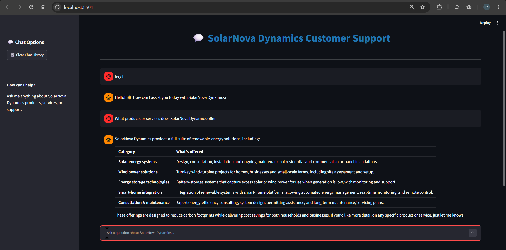
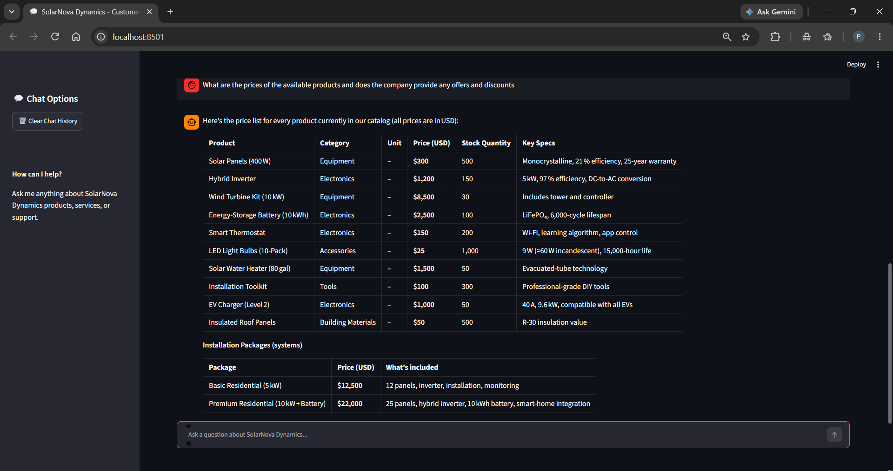
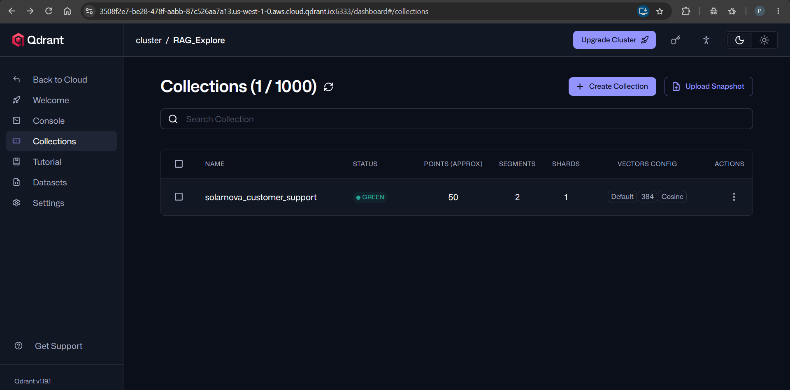
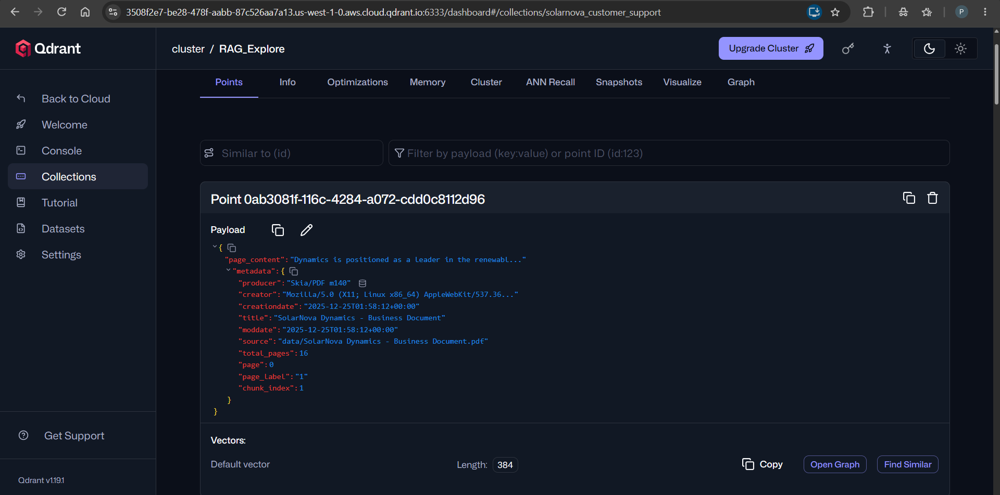

# 🤖 SolarNova Dynamics Customer Support Chatbot

### Retrieval-Augmented Generation chatbot for intelligent, context-aware customer support

An AI-powered customer support chatbot built with **Retrieval-Augmented Generation (RAG)**, **LangChain**, **Qdrant**, **Hugging Face embeddings**, and **Groq LLM inference**.

The system retrieves relevant information from SolarNova Dynamics’ business documentation and generates grounded responses through a conversational interface. It also maintains chat history using SQLite to support context-aware interactions across multiple messages.

---

## 🚀 Project Highlights

* Built an end-to-end **RAG pipeline** for document-grounded question answering.
* Implemented semantic search using **Hugging Face sentence embeddings**.
* Used **Qdrant Vector Database** to store and retrieve document embeddings.
* Integrated a Groq-hosted large language model through an OpenAI-compatible API.
* Added conversational memory using **SQLite-backed chat history**.
* Developed an interactive **Streamlit web application**.
* Added automatic document processing, chunking, embedding generation, and vector-store initialization.
* Structured the application into separate modules for configuration, document processing, vector storage, and chatbot execution.

---

## 🎯 Problem Statement

Traditional customer support systems may require users to manually search through business documents or wait for support representatives.

This project addresses that problem by creating an intelligent chatbot that can:

1. Understand natural-language customer questions.
2. Search relevant information from company documentation.
3. Use retrieved context to generate helpful responses.
4. Maintain conversational context during a session.
5. Provide a simple web-based interface for users.

---

## 🧠 Solution Overview

The chatbot uses a **Retrieval-Augmented Generation architecture** instead of relying only on the language model’s pre-trained knowledge.

```text
                    ┌──────────────────────┐
                    │   Business PDF       │
                    └──────────┬───────────┘
                               │
                               ▼
                    ┌──────────────────────┐
                    │  Document Loading    │
                    │     and Chunking     │
                    └──────────┬───────────┘
                               │
                               ▼
                    ┌──────────────────────┐
                    │ Hugging Face         │
                    │ Embedding Model      │
                    └──────────┬───────────┘
                               │
                               ▼
                    ┌──────────────────────┐
                    │ Qdrant Vector Store  │
                    └──────────┬───────────┘
                               │
User Question ────────────────►│
                               ▼
                    ┌──────────────────────┐
                    │ Semantic Retrieval   │
                    │ Top-K Relevant Chunks│
                    └──────────┬───────────┘
                               │
                               ▼
                    ┌──────────────────────┐
                    │ Prompt Construction  │
                    │ + Chat History       │
                    └──────────┬───────────┘
                               │
                               ▼
                    ┌──────────────────────┐
                    │ Groq LLM             │
                    │ Response Generation  │
                    └──────────┬───────────┘
                               │
                               ▼
                    ┌──────────────────────┐
                    │ Streamlit Chat UI    │
                    └──────────────────────┘
```

---

## ✨ Key Features

| Feature               | Description                                            |
| --------------------- | ------------------------------------------------------ |
| Document-based QA     | Generates answers using the uploaded business document |
| Semantic Search       | Finds relevant content using vector similarity         |
| Vector Database       | Stores embeddings in Qdrant                            |
| Conversational Memory | Maintains previous messages using SQLite               |
| Interactive UI        | Provides a Streamlit-based chatbot interface           |
| Modular Architecture  | Separates processing, retrieval, configuration, and UI |
| Secure Configuration  | Loads API keys from environment variables              |
| CLI Support           | Supports chatbot execution through the terminal        |

---

## 🛠️ Technology Stack

### Artificial Intelligence and NLP

* Python
* LangChain
* Retrieval-Augmented Generation
* Large Language Models
* Hugging Face Sentence Embeddings
* Groq API

### Data and Infrastructure

* Qdrant Vector Database
* SQLite
* SQLAlchemy
* PyPDF

### Application Development

* Streamlit
* Python-dotenv
* Modular Python architecture

---

## 📂 Project Structure

```text
solarnova-customer-support-chatbot/
│
├── data/
│   └── SolarNova Dynamics - Business Document.pdf
│
├── config.py
├── document_processor.py
├── vector_store_setup.py
├── customer_support_chat.py
├── main.py
├── streamlit_app.py
├── requirements.txt
├── .gitignore
└── README.md
```

### Module Responsibilities

| File                       | Responsibility                                         |
| -------------------------- | ------------------------------------------------------ |
| `config.py`                | Stores application and model configuration             |
| `document_processor.py`    | Loads and splits the business PDF into chunks          |
| `vector_store_setup.py`    | Creates embeddings and manages the Qdrant vector store |
| `customer_support_chat.py` | Builds the RAG chain and conversation history          |
| `streamlit_app.py`         | Runs the interactive web application                   |
| `main.py`                  | Provides a command-line execution option               |
| `requirements.txt`         | Lists project dependencies                             |
| `.env`                     | Stores private API keys and connection details         |

---

## ⚙️ RAG Pipeline Details

### 1. Document Processing

The business PDF is loaded using `PyPDFLoader` and divided into smaller overlapping chunks using `RecursiveCharacterTextSplitter`.

```python
CHUNK_SIZE = 1000
CHUNK_OVERLAP = 200
```

Chunk overlap helps preserve context between neighboring sections of the document.

### 2. Embedding Generation

The project uses the following Hugging Face embedding model:

```text
all-MiniLM-L6-v2
```

The embeddings are configured with a vector dimension of:

```text
384
```

### 3. Vector Database

The generated embeddings are stored in a Qdrant collection named:

```text
solarnova_customer_support
```

The retriever uses similarity search to return the most relevant document chunks.

```python
RETRIEVAL_K = 3
```

### 4. Response Generation

The retrieved context is combined with the user’s question and conversation history. The resulting prompt is sent to the configured Groq-compatible language model.

### 5. Conversation Memory

Chat messages are stored using `SQLChatMessageHistory` with SQLite, allowing the chatbot to maintain context during a conversation session.

---

## 🖥️ Application Screenshots

### Streamlit Chatbot Interface

The Streamlit application provides a simple interface for asking customer support questions and viewing generated responses.

> Add your screenshot to the repository and update the image path below.



### Customer Query and Generated Response



---

## 🗄️ Qdrant Vector Database

Qdrant is used to store and retrieve the vector representations of document chunks.

The Qdrant dashboard can be used to inspect:

* Collection name
* Vector dimensions
* Distance metric
* Stored points
* Collection status
* Indexed document embeddings

### Qdrant Collection



### Qdrant Dashboard



---

## 🔧 Installation and Setup

### 1. Clone the Repository

```bash
git clone https://github.com/PAVANI-MYNAM/solarnova-customer-support-chatbot.git
cd solarnova-customer-support-chatbot
```

### 2. Create a Virtual Environment

```bash
python -m venv venv
```

Activate the environment on Windows:

```bash
venv\Scripts\activate
```

### 3. Install Dependencies

```bash
pip install -r requirements.txt
```

### 4. Configure Environment Variables

Create a `.env` file in the project root:

```env
QDRANT_URL=your_qdrant_url
QDRANT_API_KEY=your_qdrant_api_key
GROQ_API_KEY=your_groq_api_key
```

Do not upload `.env` to GitHub.

---

## ▶️ Running the Application

### Streamlit Application

```bash
streamlit run streamlit_app.py
```

### Command-Line Application

```bash
python main.py
```

During the initial execution, the application checks the Qdrant collection and processes the business PDF if the vector collection has not been populated.

---

## 📌 Configuration

The main settings are available in `config.py`.

```python
EMBEDDING_MODEL = "all-MiniLM-L6-v2"
EMBEDDING_DIMENSIONS = 384
CHUNK_SIZE = 1000
CHUNK_OVERLAP = 200
RETRIEVAL_K = 3
```

---

## 🔐 Security Considerations

* API keys are loaded through environment variables.
* The `.env` file is excluded using `.gitignore`.
* Chat-history database files are excluded from version control.
* Private credentials should never be committed to the repository.

---

## 🔮 Future Enhancements

* Add source citations for retrieved document passages.
* Add response evaluation using faithfulness and relevance metrics.
* Add automated RAG evaluation with test questions.
* Support multiple business documents.
* Add document upload functionality.
* Add user feedback and response-rating functionality.
* Add chat export functionality.
* Add authentication and role-based access.
* Deploy the application to a cloud platform.
* Add monitoring for retrieval quality and LLM response latency.

---

## 👩‍💻 Author

**Pavani Mynam**
